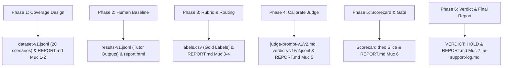

# K3 Track 1 · Day 20–21 — AI Evaluation Capstone (eval-kit)

## 📌 Thông tin Cá nhân & Nhóm
- **Mã học viên:** `2A202601578`
- **Họ và tên:** **Trần Thanh Huyền**
- **Repo nộp bài:** `Track1_Day21_2A202601578_TranThanhHuyen`
- **Danh sách thành viên nhóm 3 người:**
  1. **Trần Thanh Huyền** (Mã HV: 2A202601578 - Trưởng nhóm)
  2. **Thiều Thị Ngọc Ánh** (Mã HV: 2A202601864)
  3. **Đỗ Tú Anh** (Mã HV: 2A202601272)

---

## 🗺️ Sơ đồ 6 Phase & Artifacts tương ứng



* **Phase 1: Coverage Design:** Thiết kế Input Grid 3 dimensions $\rightarrow$ Output: `dataset-v1.jsonl`.
* **Phase 2: Human Baseline:** Chạy Tutor thật log trace Braintrust $\rightarrow$ Output: `results-v1.jsonl`, `report.html`.
* **Phase 3: Rubric & Routing:** 3 thành viên chấm độc lập (Human Agreement 90%) $\rightarrow$ Output: `labels.csv` (Gold labels), Bảng Routing Map.
* **Phase 4: Calibrate LLM Judge:** Calibrate `gpt-4o-mini` qua 2 vòng (Agreement 65% $\rightarrow$ 85%) $\rightarrow$ Output: `judge-prompt-v1/v2.md`, `verdicts-v1/v2.jsonl`.
* **Phase 5: Scorecard & Gate:** Kiểm tra theo pre-committed thresholds & slice breakdown $\rightarrow$ Output: Scorecard & Đọc tay 3 trace fail.
* **Phase 6: Verdict & Report A-Z:** Ra phán quyết chính thức $\rightarrow$ Output: `REPORT.md` (7 mục), `ai-support-log.md`, `braintrust-link.md`.

---

## 👥 Phân công & Đóng góp của từng thành viên (Nhóm 3 người)

| Thành viên | Phụ trách chính | Các artifact & công việc cụ thể |
|---|---|---|
| **Trần Thanh Huyền**<br>*(Mã HV: 2A202601578 - Trưởng nhóm)* | **Phase 1 (Coverage Design) & Eval Infrastructure** | • **Phase 1:** Chủ trì thiết kế Lưới kiểm thử (Input Grid 3 dimensions), xây dựng & chốt 20 scenarios (`dataset-v1.jsonl`).<br>• **Hạ tầng & Tracing:** Cấu hình Braintrust/LangSmith Tracing logger (`tracing.py`), thực thi `run_eval.py` để thu thập `results-v1.jsonl`.<br>• **Report & Management:** Tổng hợp Mục 1, 2 & 7 trong `REPORT.md`, chủ trì thảo luận chốt Verdict `HOLD`. |
| **Nguyễn Thị Ánh**<br>*(Mã HV: 2A20260xxxx)* | **Phase 2 (Human Baseline) & Phase 3 (Code Rules & Routing)** | • **Phase 2:** Chủ trì quy trình gán nhãn người (`labels-anh.csv`), chạy `agreement.py` đo chỉ số Human-Human Agreement (đạt **90%**).<br>• **Phase 3 (Code Check):** Lập trình mở rộng làn kiểm thử Code `eval/code_checks.py` (`schema_valid`, `citation_exists`, `quote_verbatim`, `check_followup_count`) giúp tối ưu chi phí API ($0/run).<br>• **Report:** Xây dựng chi tiết Rubric v1 (Mục 3) và Bảng Routing Map (Mục 4) trong `REPORT.md`. |
| **Phạm Tú Anh**<br>*(Mã HV: 2A20260yyyy)* | **Phase 4 (Judge Calibration) & Phase 5 (Scorecard & Gate)** | • **Phase 4:** Phụ trách tinh chỉnh `eval/judge_prompt.md` qua 2 vòng (V1 → V2), thêm các ví dụ Near-Miss nâng Agreement từ 65% lên **85%**.<br>• **Phase 5:** Đặt pre-committed thresholds, phân tích Slice Breakdown & đọc tay 3 trace fail lớn nhất (`sc-12`, `sc-06`, `sc-05`).<br>• **Report:** Tổng hợp Calibration Report (Mục 5), Scorecard & Gate (Mục 6) trong `REPORT.md`, đề xuất hướng sửa System Prompt. |

---

### 👤 Đóng góp cá nhân dành riêng cho người nộp bài (Trần Thanh Huyền)
- **Phụ trách chính Phase 1 & Hạ tầng Eval:** Thiết kế Lưới kiểm thử (User Input Grid), xây dựng 20 scenarios đa dạng tình huống bám sát slide Day 19-20 và 18 tài liệu corpus (`dataset-v1.jsonl`).
- **Triển khai Tracing & Chạy Eval:** Cấu hình Braintrust Tracing logger (`BRAINTRUST_PROJECT=ai-evaluation`), thực thi `run_eval.py` thu thập dữ liệu thô `results-v1.jsonl`.
- **Chấm nhãn & Quản lý bài nộp:** Chấm nhãn độc lập `labels-huyen.csv`, chủ trì thảo luận nhóm chốt nhãn vàng đồng thuận, hoàn thiện các Mục 1, 2, 7 trong `REPORT.md` và chốt Verdict `HOLD`.

---

## 🎯 Verdict của Nhóm & Lý do
**VERDICT: HOLD (CHƯA SHIP)**
- **Lý do:**
  1. `scope_accuracy` đạt 95% (thấp hơn ngưỡng Pre-committed Gate 100% do 1 lỗi `sc-12` viết hộ prompt Capstone).
  2. Critical Slice câu mơ hồ (`sc-06`, `sc-07`) vi phạm contract xử lý thiếu bối cảnh (pass rate 0%).
  3. `quote_verbatim` đạt 65% (thấp hơn ngưỡng 80%).
- **Đòn bẩy tiếp theo:** Sửa `SYSTEM_PROMPT` trong `tutor/tutor.py` để chặn làm hộ bài tập và tự phỏng đoán câu mơ hồ, re-run eval v2 trước khi release.

---

## 💡 Bài học mang về áp dụng cho dự án thật
1. **Chốt Threshold TRƯỚC khi xem số:** Giúp PM giữ nguyên kỷ luật chất lượng sản phẩm, không bị cám dỗ "thương lượng hạ tiêu chuẩn" sau khi nhìn thấy kết quả candidate.
2. **Disagreement là tài sản:** Bất đồng giữa các thành viên bộc lộ lỗ hổng trong Rubric $\rightarrow$ dùng bất đồng để siết chặt tiêu chuẩn chấm.
3. **Ưu tiên Code Check trước LLM Judge:** Làn Code Check ($0/run) xử lý cực kỳ chính xác các tiêu chí kỹ thuật (JSON schema, citation, verbatim quote), giúp giảm gánh nặng và chi phí cho LLM Judge.

---

## Cấu trúc repo

| Thư mục / file | Vai trò |
|---|---|
| `tutor/` | **Sản phẩm đang được đánh giá** — tutor thật (`tutor.py`: system prompt + tool-calling `kb_search`, BM25 retrieval) và `corpus/` 18 tài liệu nguồn + `manifest.json` (địa chỉ nguồn: `doc_id#section_id`) |
| `eval/` | **Bộ máy chấm** — code chạy & phân tích eval + tracking: `run_eval.py`, `code_checks.py`, `judge.py`, `agreement.py`, `report.py`, `tracing.py`, kèm `judge_prompt.md` (prompt judge — **file bạn sẽ sửa nhiều nhất khi calibrate**) |
| `deliverables/` | **Khung bài nộp** — report log A→Z, lock input/output/quyết định từng bước: `REPORT.md` một file gồm 7 mục quyết định theo phase (1 Input Grid … 7 Verdict) + `evidence/` chứa data thô dẫn chứng (xem README trong đó) |
| `tests/` | `test_eval_kit.py` — 44 test offline (không tốn API), chạy trước khi làm bất cứ thứ gì |
| `data/` | File mẫu: `dataset.example.jsonl` (5 câu đủ loại: in-scope, out-of-scope, mơ hồ, xin đáp án) và `labels.example.csv` (format nhãn người) |
| root | File làm việc (scratch) bạn sinh ra khi chạy: `dataset.jsonl`, `results.jsonl`, `verdicts.jsonl`, `labels.csv`, `report.html` (đã gitignore, không commit) |

**Mọi lệnh đều chạy từ root repo** (thư mục chứa README này). Luồng làm việc: file
scratch sinh ra ở root → chốt một vòng thì copy vào `deliverables/evidence/`, đặt tên
theo version (`results-v1.jsonl`, `verdicts-v2.jsonl`...), không ghi đè vòng cũ.

## Quickstart (3 phút)

```bash
pip install -r requirements.txt        # 1. cài đặt (chỉ cần requests; braintrust/langsmith để tracing)
cp .env.example .env                   # 2. điền API key của provider bạn dùng (+ BRAINTRUST_API_KEY hoặc LANGSMITH_API_KEY để log trace)
cp data/dataset.example.jsonl dataset.jsonl
python3 tests/test_eval_kit.py         # 3. 44 test offline phải sạch hết
python3 eval/run_eval.py                # 4. chạy tutor trên dataset -> results.jsonl
python3 eval/report.py && open report.html   # 5. xem kết quả, gán nhãn
```

Gợi ý: nếu test fail ngay tầng 2 (corpus), gần như chắc chắn bạn đang chạy sai thư mục —
`cd` vào đúng root repo rồi chạy lại.

## Làm bài theo 6 phase — bước nào chạy gì?

| Phase (theo file lab tổng) | Làm ở đâu | Trong repo này chạy gì |
|---|---|---|
| **P1. Thiết kế coverage** — chọn dimensions, tổ hợp, sinh câu hỏi | Giấy/sheet + AI chat | Chưa cần repo. Kết quả: viết vào `dataset.jsonl` (format xem `data/dataset.example.jsonl`, nhớ field `metadata.slide`) |
| **P2. Human baseline** — chạy dataset, chấm tay | Repo | `python3 eval/run_eval.py` → `python3 eval/report.py` → mở `report.html` gán nhãn → Export `labels-<tên>.csv` → `python3 eval/agreement.py labels-*.csv` đo đồng thuận |
| **P3. Rubric + routing** | Thảo luận nhóm | Không chạy repo. Viết vào mục 3 (Rubric v1) và mục 4 (Routing Map) trong `deliverables/REPORT.md` |
| **P4. Scale & calibrate judge** | Repo | `python3 eval/code_checks.py` (làn code) → sửa `eval/judge_prompt.md` → `python3 eval/judge.py` → đọc confusion matrix + % agreement. Sửa ít một thứ, chạy lại — mỗi vòng copy `eval/judge_prompt.md` + `verdicts.jsonl` ra `deliverables/evidence/` |
| **P5. Đọc kết quả, đặt ngưỡng** | Repo | `results.jsonl` có sẵn latency/tokens/cost từng câu; `report.html` để đọc theo slice |
| **P6. Verdict + report** | Viết trong `deliverables/` | Điền mục 6 (Scorecard & Gate) và mục 7 (Verdict) trong `deliverables/REPORT.md` |

**Nguyên tắc nộp bài:** mỗi bước phải nộp đủ **đầu vào + đầu ra (data thô) + quyết định
kèm vì sao**. Cấu trúc thư mục nộp và checklist: [deliverables/README.md](deliverables/README.md).

**Tracing bắt buộc:** đặt `BRAINTRUST_API_KEY` hoặc `LANGSMITH_API_KEY` trong `.env`
trước khi chạy — mọi run tutor/judge log thành trace, link project là một phần bài nộp.

## Chi tiết từng lệnh

```bash
python3 eval/run_eval.py      # 1. chạy tutor trên dataset.jsonl      -> results.jsonl
python3 eval/code_checks.py   # 2. làn code: rule thuần Python trên results (không tốn API)
python3 eval/report.py        # 3. sinh report.html -> mở, gán nhãn người, Export labels.csv
python3 eval/agreement.py labels-*.csv   # 4. đo đồng thuận giữa các thành viên
python3 eval/judge.py         # 5. judge chấm theo judge_prompt.md -> verdicts.jsonl + confusion matrix
```

Mỗi lệnh ghi đè file output của nó — muốn giữ vòng cũ, copy file đi trước
(vd `cp results.jsonl deliverables/evidence/results-v1.jsonl`).

Chỉ chấm vài câu: `python3 eval/judge.py sc-01 sc-03`.
Chạy dataset khác: `python3 eval/run_eval.py ten-file.jsonl`.

### Bước 1 — `eval/run_eval.py`: tutor thật chạy trên dataset

- Đọc từng dòng `dataset.jsonl`, gọi tutor theo **cơ chế tool-calling thật**:
  model tự quyết định gọi `kb_search` bao nhiêu lần, với truy vấn nào (xem trong
  `results.jsonl`, trường `tool_calls`).
- In từng dòng: thời gian, số token, chi phí ước tính. Tổng chi phí in ở cuối.
- Gợi ý: chạy thử `data/dataset.example.jsonl` (5 câu) trước khi chạy dataset lớn của nhóm.

### Bước 2 — `eval/code_checks.py`: làn code

- 3 rule có sẵn: `schema_valid` (JSON đủ 4 field), `citation_exists` (doc_id/section_id
  có thật trong corpus), `quote_verbatim` (quote nằm đúng trong section đã cite).
- Mở `eval/code_checks.py`, thêm 1–2 hàm `check_*` của riêng nhóm cho tiêu chí làn Code.

### Bước 3 — `eval/judge.py`: LLM judge chấm

- Judge là model KHÁC tutor (mặc định `gpt-4o-mini`) — tránh tự chấm chéo.
- Rubric judge nằm trong `eval/judge_prompt.md` — **đây là file bạn sẽ sửa nhiều nhất** khi
  calibrate. Sửa ít một thứ mỗi vòng, chạy lại, so agreement.
- Chấm một vài câu thôi: `python3 eval/judge.py sc-01 sc-03`.
- Nếu `labels.csv` đã có nhãn người (export từ report), judge.py in luôn confusion matrix
  + % agreement — **đây là con số calibration của bạn**.

### Bước 4 — `eval/report.py`: nhìn và gán nhãn

- `report.html` tự chứa mọi dữ liệu: câu hỏi, slide context, câu trả lời, nguồn trích,
  verdict judge. Bấm pass/fail/uncertain và nhập **note ngắn** (vd tiêu chí gây
  fail: `fail: citation`) để gán nhãn người (lưu trong trình duyệt).
- Bấm **Export labels.csv** → lưu đè `labels.csv` → chạy lại `eval/judge.py` để xem agreement.

### Những việc mổ xẻ sâu hơn

| Việc | Làm sao |
|---|---|
| Xem tutor gọi `kb_search` với truy vấn gì, bao nhiêu vòng | Mở `results.jsonl`, trường `tool_calls` và `steps` của từng row |
| Sửa retrieval (BM25, top-k) để thử nghiệm | Sửa `retrieve_corpus()` trong `tutor/tutor.py` |
| Đọc system prompt thật của tutor | Đầu file `tutor/tutor.py` — biến `SYSTEM_PROMPT` |
| Chạy judge bằng model khác để so sánh | `EVAL_JUDGE_MODEL=deepseek/deepseek-v4-flash python3 eval/judge.py` |
| Xem raw output chưa parse (khi JSON vỡ) | `results.jsonl` trường `raw_content`; report.html nút "xem raw" |
| Test offline toàn bộ pipeline | `python3 tests/test_eval_kit.py` (không tốn API) |

## Chọn model & provider

Model viết dạng `provider/model` — repo gọi **thẳng API chuẩn của từng hãng**:

| Prefix model | Cần key trong .env |
|---|---|
| `openai/gpt-4o-mini`, ... | `OPENAI_API_KEY` |
| `deepseek/deepseek-v4-flash`, ... | `DEEPSEEK_API_KEY` |
| `gemini/gemini-3.1-flash-lite`, ... | `GEMINI_API_KEY` |
| `anthropic/claude-...` | `ANTHROPIC_API_KEY` |
| `openrouter/<vendor>/<model>` | `OPENROUTER_API_KEY` |

| Biến | Mặc định | Ý nghĩa |
|---|---|---|
| `EVAL_MODEL` | `deepseek/deepseek-v4-flash` | Model của tutor |
| `EVAL_JUDGE_MODEL` | `openai/gpt-4o-mini` | Model của judge (nên KHÁC tutor — tránh tự chấm chéo) |
| `BRAINTRUST_API_KEY` | — | Bật log trace lên Braintrust (bắt buộc một trong hai khi nộp bài) |
| `LANGSMITH_API_KEY` | — | Bật log trace lên LangSmith (thay cho Braintrust; `LANGCHAIN_API_KEY` cũng được) |
| `EVAL_BASE_URL` + `EVAL_API_KEY` | — (không đặt = gọi thẳng provider) | Tuỳ chọn: gateway OpenAI-compatible riêng |

## Tracing (bắt buộc khi nộp bài)

Mọi run tutor/judge phải được log trace — đây là minh chứng bạn chạy thật.

- **Braintrust:** tạo project (vd `ai-evaluation`) trên braintrust.dev, lấy API key, đặt
  vào `.env`: `BRAINTRUST_API_KEY=sk-...`. Từ đó `run_eval.py` và `judge.py` tự log mỗi
  câu thành một trace (input, output, tool calls, tokens, cost).
- **LangSmith:** tạo project trên smith.langchain.com, lấy API key, đặt vào `.env`:
  `LANGSMITH_API_KEY=lsv2_pt_...` (tuỳ chọn `LANGSMITH_PROJECT=ai-evaluation`).
  Code tự nhận backend — không cần sửa gì thêm. Chỉ cần một trong hai.

Khi nộp: ghi link project (Braintrust hoặc LangSmith) vào `deliverables/evidence/braintrust-link.md`.

## Định dạng một dòng dataset

```json
{"scenario_id": "sc-01-in-judge", "input": "câu hỏi của học viên",
 "expected_scope": "in_scope", "note": "ghi chú ngắn của nhóm",
 "metadata": {"slide": {"id": "s53", "title": "Pass rate giống nhau — không có nghĩa judge nghĩ giống bạn",
                        "keyword": "calibration"}}}
```

- `input` là bắt buộc — câu hỏi như học viên thật viết. `scenario_id` là mã duy nhất
  của row (code cũng chấp nhận `id`, nhưng hãy dùng `scenario_id` cho thống nhất —
  xem mẫu `data/dataset.example.jsonl`).
- `expected_scope` / `note` (tuỳ chọn): kỳ vọng in-scope/out-of-scope và ghi chú của nhóm.
- Các thông tin grid (`dimension_values`, `expected_behavior`, `risk_if_fail`,
  `set_type`...) đặt trong `metadata` để sau lọc theo slice.
- `metadata.slide` (khi câu gắn slide) là slide học viên đang xem khi hỏi — đưa vào
  prompt tutor và cả judge, để câu deixis kiểu "giải thích đoạn này" chấm được đúng
  bối cảnh. Câu noise/out-of-scope không gắn slide thì bỏ field này.

## Gỡ lỗi nhanh

| Triệu chứng | Nguyên nhân thường gặp |
|---|---|
| `Chưa có API key...` | Thiếu `.env`, hoặc tên biến sai family (deepseek cần `DEEPSEEK_API_KEY`) |
| Row có `_parse_error` / `_truncated` | Model trả JSON vỡ (thường do cắt output) — mở `raw_content` xem; đó là một failure mode thật, đáng ghi vào bài |
| Judge toàn 401 | Sai key cho provider của model judge (xem bảng provider ở trên), hoặc shell đang export sẵn `OPENAI_API_KEY` khác — kiểm tra `env \| grep OPENAI` |
| Retrieve trượt chủ đề | Câu hỏi quá ngắn/deixis — gắn `metadata.slide` với `keyword` vào row dataset |

## Nộp bài thì lấy gì từ repo?

Quy cách nộp đầy đủ: **[deliverables/README.md](deliverables/README.md)** (đã align với mục 10
của file lab tổng). Từ repo này, copy sang `deliverables/evidence/` của bài nộp:

- `dataset.jsonl` → `deliverables/evidence/dataset-v1.jsonl` — dataset nhóm chốt (đầu vào).
- `results.jsonl` → `deliverables/evidence/results-v1.jsonl` (v2, v3... mỗi lần chạy lại) — output
  tutor thật, có cả `tool_calls`, tokens, cost từng câu.
- `verdicts.jsonl` → `deliverables/evidence/verdicts-v1.jsonl` (v2... từng vòng calibration).
- `eval/judge_prompt.md` → `deliverables/evidence/judge-prompt-v1.md` (copy MỖI LẦN trước khi sửa).
- `labels.csv` (export từ report.html) → `deliverables/evidence/labels.csv` — nhãn người.
- Số liệu agreement/confusion matrix in ra từ `eval/judge.py` → chép vào
  mục 5 của `deliverables/REPORT.md`.

Nhớ: chạy xong một vòng là copy ngay — cuối buổi mới gom là mất dấu các vòng trước.

## Lưu ý

- Model deepseek v4 được gửi kèm `"thinking": {"type": "disabled"}` (đã xử lý sẵn trong
  `tutor/tutor.py`) — thiếu nó output sẽ bị reasoning tokens ăn mất.
- Tutor chạy `max_tokens=2000`: câu dài bị cắt giữa JSON sẽ được đánh dấu
  `_truncated`/`_parse_error` trong `results.jsonl` — đó là một failure mode thật,
  đáng ghi vào bài, đừng xoá.
- Provider thỉnh thoảng trả HTTP 200 nhưng body JSON bị cắt ngang — `chat()` tự retry
  tối đa 3 lần.
- `.env` trong repo được nạp **ghi đè** biến shell sẵn có — nếu shell bạn export sẵn
  `OPENAI_API_KEY` khác thì `.env` vẫn thắng.
- `report.py` không gọi mạng; `report.html` nhúng sẵn toàn bộ dữ liệu.
- Giá token dùng để ước tính chi phí nằm trong `eval/run_eval.py` (biến `PRICING`).
